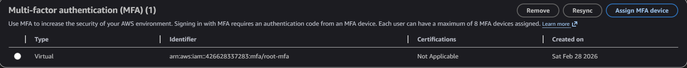
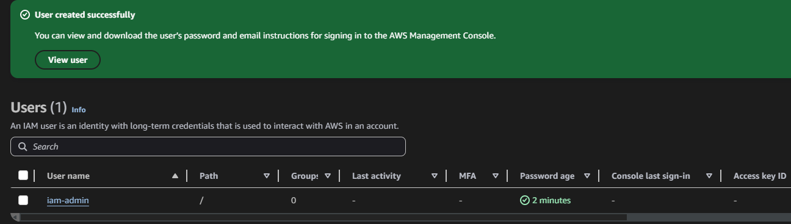

# Module 1 — Account Hardening & MFA Enforcement

[← Back to Main README](./README.md)

## Objective

Secure the AWS root account and establish a properly configured IAM admin user with multi-factor authentication enforced on both accounts. This mirrors the Day 1 account hardening process that cloud security engineers perform on any new AWS environment.

---

## Background

When an AWS account is first created, the login used to create it is called the **root user**. Root has unrestricted access to every resource and service in the account — it cannot be limited by any IAM policy. Because of this, root credentials are a critical target for attackers.

The industry-standard approach is to:
1. Enable MFA on root immediately
2. Create a named IAM user for all day-to-day administrative work
3. Lock root away and never use it again except for specific account-level tasks

---

## Steps Performed

### 1. Enabled MFA on Root Account

Navigated to the root account security credentials page and assigned a virtual MFA device using Google Authenticator. Two consecutive TOTP codes were entered to complete the binding.

### 2. Created IAM Admin User

Created a named IAM user `iam-admin` with console access and the AWS managed `AdministratorAccess` policy attached. This user serves as the administrative identity for all subsequent lab activity, replacing root for day-to-day use.

### 3. Enforced MFA on IAM Admin User

Assigned a separate virtual MFA device to the `iam-admin` user via the Security Credentials tab in IAM. From this point forward, all console access requires both a password and a TOTP code.

## Key Concepts

**Why MFA on root?**
If root credentials are compromised without MFA, an attacker has unlimited, irrevocable access to the entire AWS account. They can delete all resources, exfiltrate data, create backdoor accounts, and disable logging. MFA adds a second factor that cannot be phished with credentials alone.

**Why stop using root?**
Every action in AWS generates an API call that is logged in CloudTrail. If all administrative work is done as root, there is no way to distinguish between legitimate admin activity and an attacker using stolen root credentials. Named IAM users create an auditable identity trail.

**Why MFA on the admin IAM user?**
`AdministratorAccess` is effectively equivalent to root for most purposes. Any account with that level of privilege is a high-value target and must be protected with MFA.
