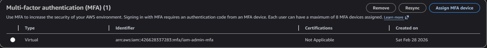
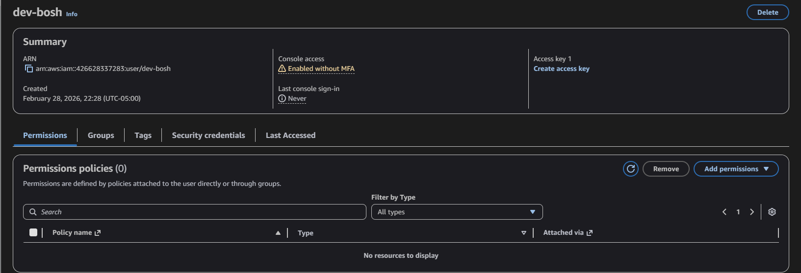
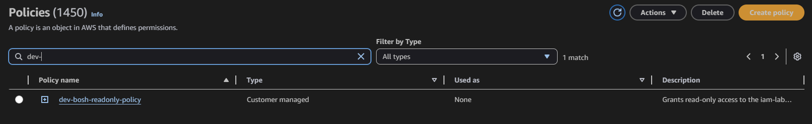
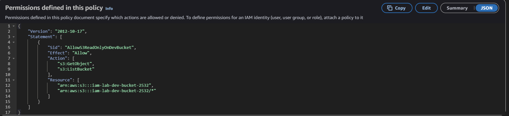
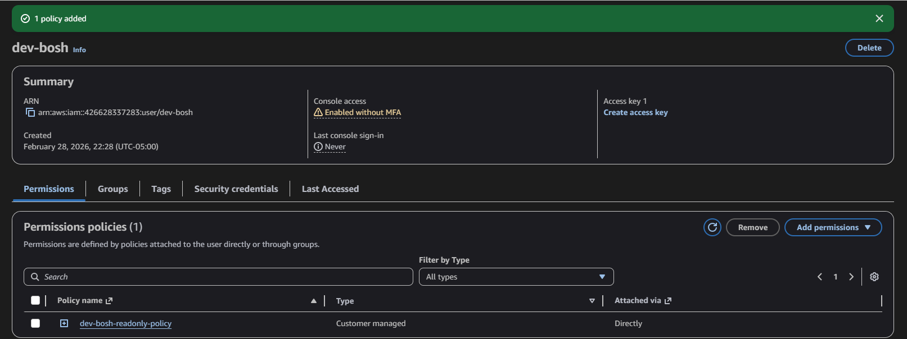
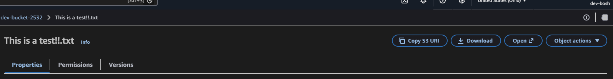
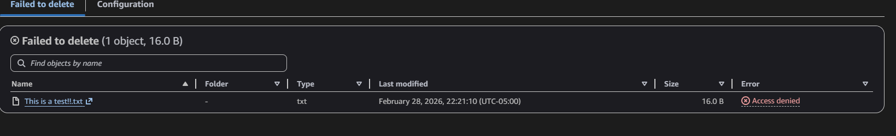

# Module 2 — Least Privilege Policy Writing

[← Back to Main README](./README.md)

## Objective

Design, write, and validate a custom IAM policy that grants a developer user the minimum permissions required to do their job, and nothing more. Test the policy to confirm both permitted and denied actions behave as expected.

---

## Background

The principle of least privilege states that every user, service, or application should have access only to the resources and actions it explicitly needs. In practice, this means writing scoped IAM policies rather than attaching broad managed policies like `AmazonS3FullAccess`.

Overly permissive IAM policies are one of the most common findings in cloud security assessments. A developer who only needs to read files from one S3 bucket should not have the ability to delete files, access other buckets, or interact with any other AWS service.

---

## Steps Performed

### 1. Created S3 Bucket

Created the bucket `iam-lab-dev-bucket-2532` with all public access blocked. Uploaded a sample file to use as a test object.



### 2. Created IAM User with Zero Permissions

Created the user `dev-bosh` with console access and deliberately attached no permissions. This reflects the correct pattern — new users start with nothing and access is granted deliberately.



### 3. Authored Custom Least Privilege Policy

Created a custom policy `dev-bosh-readonly-policy` using the JSON policy editor. The policy contains two statements:

```
{
  "Version": "2012-10-17",
  "Statement": [
    {
      "Sid": "AllowS3ReadOnlyOnDevBucket",
      "Effect": "Allow",
      "Action": [
        "s3:GetObject",
        "s3:ListBucket"
      ],
      "Resource": [
        "arn:aws:s3:::iam-lab-dev-bucket-2532",
        "arn:aws:s3:::iam-lab-dev-bucket-2532/*"
      ]
    }
  ]
}
```

 
 

### 4. Attached Policy to dev-bosh

Attached `dev-bosh-readonly-policy` directly to the `dev-bosh` user via the Permissions tab.



### 5. Validated Policy Enforcement

Logged into a separate incognito browser window as `dev-bosh` and tested the following:
```

| Action | Expected Result | Actual Result |
|--------|----------------|---------------|
| Access S3 object directly via URL | Allow | Allowed |
| Delete file from bucket | Deny | Access Denied |
```



