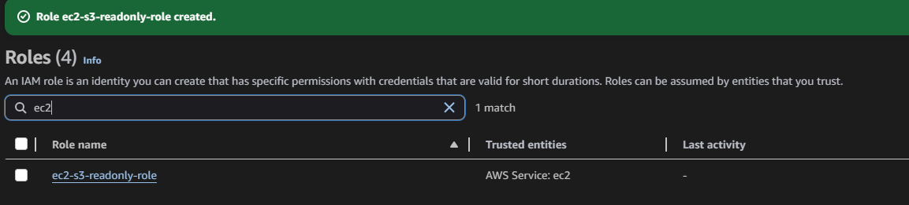
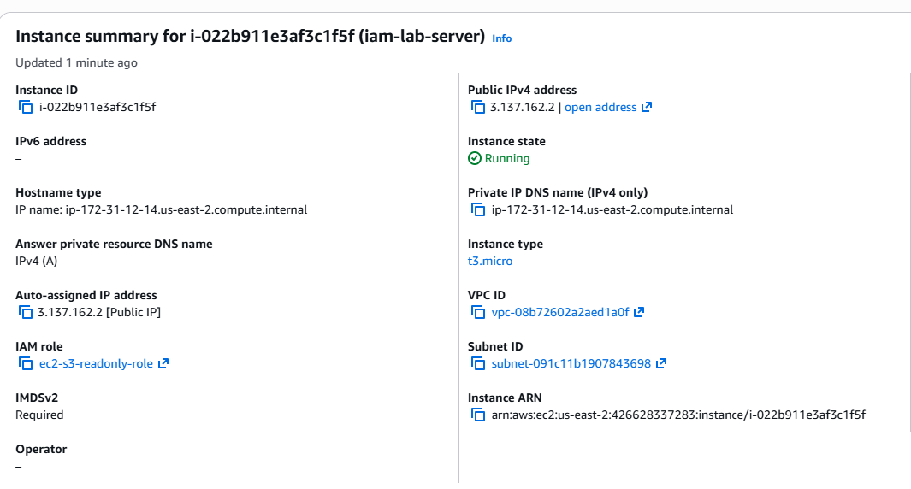
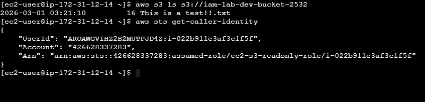
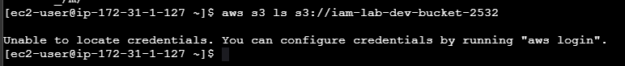

# Module 3 — Role-Based Access Control

[← Back to Main README](./README.md)

## Objective

Create an IAM role for an EC2 instance that provides scoped S3 access using temporary credentials, and demonstrate why this pattern is superior to hardcoded credentials by comparing an instance with a role attached against one without.

---

## Background

IAM roles are the industry-standard mechanism for giving AWS services access to other AWS services. Unlike IAM users, roles do not have permanent credentials. Instead, they issue short-lived temporary credentials via the AWS Security Token Service (STS) that expire automatically and rotate without any human intervention.

The alternative, embedding IAM user access keys directly into application code or server configuration is one of the most common causes of cloud data breaches.

---

## Steps Performed

### 1. Created IAM Role for EC2

Created the role `ec2-s3-readonly-role` with EC2 as the trusted entity. Attached the existing `dev-bosh-readonly-policy` to grant the same scoped S3 read access.

The auto-generated trust policy:
```json
{
  "Version": "2012-10-17",
  "Statement": [
    {
      "Effect": "Allow",
      "Principal": {
        "Service": "ec2.amazonaws.com"
      },
      "Action": "sts:AssumeRole"
    }
  ]
}
```


### 2. Launched EC2 Instance with Role Attached

Launched an Amazon Linux t2.micro instance named `iam-lab-server` and attached `ec2-s3-readonly-role` as the IAM instance profile during launch configuration.



### 3. Verified Role and S3 Access via Instance Connect

Connected to the instance using EC2 Instance Connect and ran two verification commands:

**List S3 bucket contents:**
```bash
aws s3 ls s3://iam-lab-dev-bucket-2532
```
Result: Successfully listed the file in the bucket, the instance authenticated using the role's temporary credentials automatically.

**Verify identity being used:**
```bash
aws sts get-caller-identity
```
Result: Returned a JSON object showing the role ARN as the identity, confirming no user credentials were involved.


### 4. Demonstrated the Anti-Pattern (No Role Attached)

Launched a second instance `iam-lab-server-norole` with identical configuration but no IAM instance profile attached. Connected via Instance Connect and ran:
```bash
aws s3 ls s3://iam-lab-dev-bucket-2532
```

Result: `Unable to locate credentials` — the instance has no identity and cannot authenticate to any AWS service.



--- 

## Key Concepts

**Two-policy model:** Every IAM role has two policies — the **permissions policy** (what the role can do) and the **trust policy** (who is allowed to assume the role). Both must be correctly configured for the role to work.

**STS (Security Token Service):** The AWS service that issues temporary credentials when a role is assumed. Credentials issued by STS include an access key, secret key, and session token — all of which expire automatically.

**Instance Profile:** The container that holds an IAM role and attaches it to an EC2 instance. When an application running on the instance calls an AWS API, it automatically receives temporary credentials from the instance metadata service without any configuration needed.
