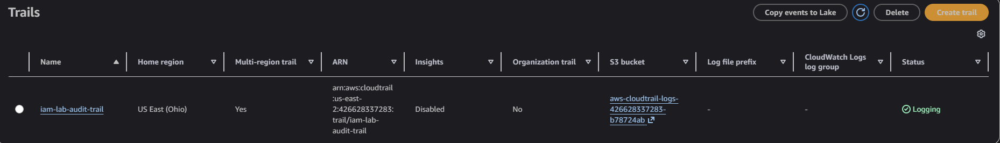
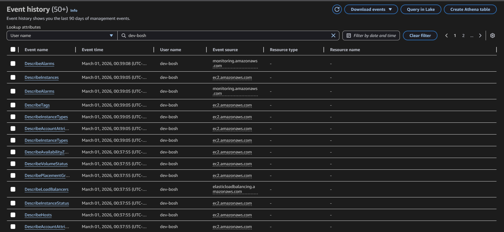
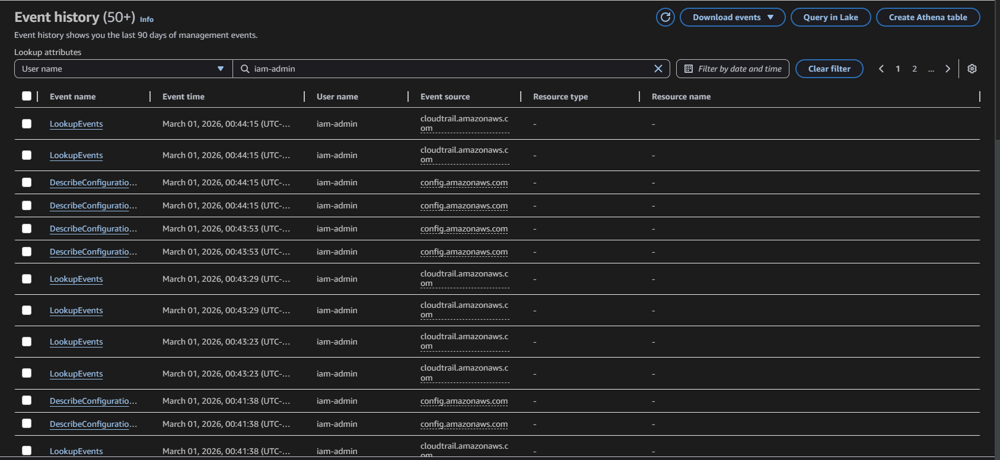
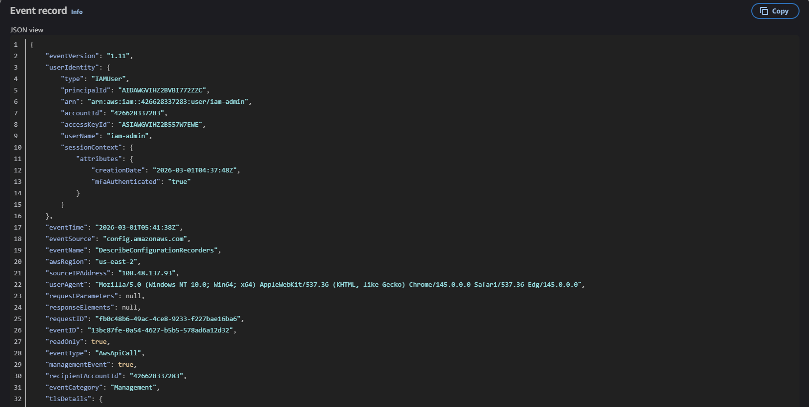
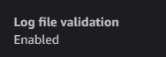

# Module 4 — Auditing & Monitoring with CloudTrail

[← Back to Main README](./README.md)

## Objective

Enable AWS CloudTrail to capture all API activity across the account, investigate the audit logs generated by previous lab modules, identify access denied events as security signals, and verify log integrity controls are in place.

---

## Background

CloudTrail records every API call made in an AWS account, who made it, what they did, when, and from where. It is the foundational audit and investigation tool in AWS and is required by virtually every enterprise compliance framework including SOC 2, PCI-DSS, and HIPAA.

Without CloudTrail, a security team has no visibility into what happened during an incident. With it, they can reconstruct the full timeline of an attacker's activity, identify what was accessed or modified, and determine the blast radius of a compromise.

---

## Steps Performed

### 1. Created CloudTrail Trail

Created the trail `iam-lab-audit-trail` with the following configuration:

- **Storage:** New S3 bucket for log persistence
- **Event type:** Management events — all API calls made to AWS services
- **Read/Write events:** Both enabled — captures both read operations and state-changing writes
- **Log file validation:** Enabled — uses cryptographic hashing to detect log tampering



### 2. Investigated Event History by Username

Used CloudTrail Event History to filter API activity by username. This is the core investigation workflow used during real security incidents.

**Filtered by `dev-bosh`:**
Surfaced all actions taken by the dev-bosh account, including successful S3 object access and failed attempts to access EC2, IAM, and CloudTrail.



**Filtered by `iam-admin`:**
Surfaced all administrative actions taken throughout the lab - user creation, policy creation, role creation, EC2 instance launches, and more.



### 3. Examined Individual Event JSON

Expanded a single CloudTrail event to review the full JSON record. Key fields present in every event:

```
| Field | Description | Security Relevance |
|-------|-------------|-------------------|
| `userIdentity` | Who made the call | Identifies the user, role, or service responsible |
| `eventTime` | When it happened | Used to build attack timelines |
| `eventName` | What API was called | Identifies the action taken |
| `sourceIPAddress` | Where it came from | Can identify unexpected geographic access |
| `requestParameters` | What was targeted | Shows which specific resources were accessed |
| `errorCode` | If it failed, why | `AccessDenied` indicates unauthorized access attempts |
```


### 4. Verified Log File Validation

Confirmed that log file validation was enabled on the trail settings page. This ensures any tampering with or deletion of log files after the fact can be cryptographically detected.

 

---
## Key Concepts

**CloudTrail vs. CloudWatch:** CloudTrail logs *who did what* at the API level, it is the audit and forensics tool. CloudWatch monitors *system performance and metrics* CPU usage, error rates, latency. Both are important but they serve different purposes. Security engineers primarily use CloudTrail for investigation.

**Log file validation:** An attacker who gains admin access to an AWS account might attempt to delete or tamper with CloudTrail logs to cover their tracks. Log file validation generates a cryptographic hash of each log file and stores a digest file that can be used to verify whether any logs were modified or deleted after being written. This is a critical anti-tampering control.
